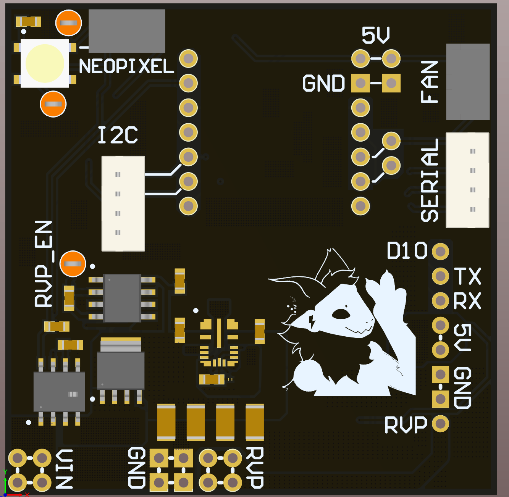
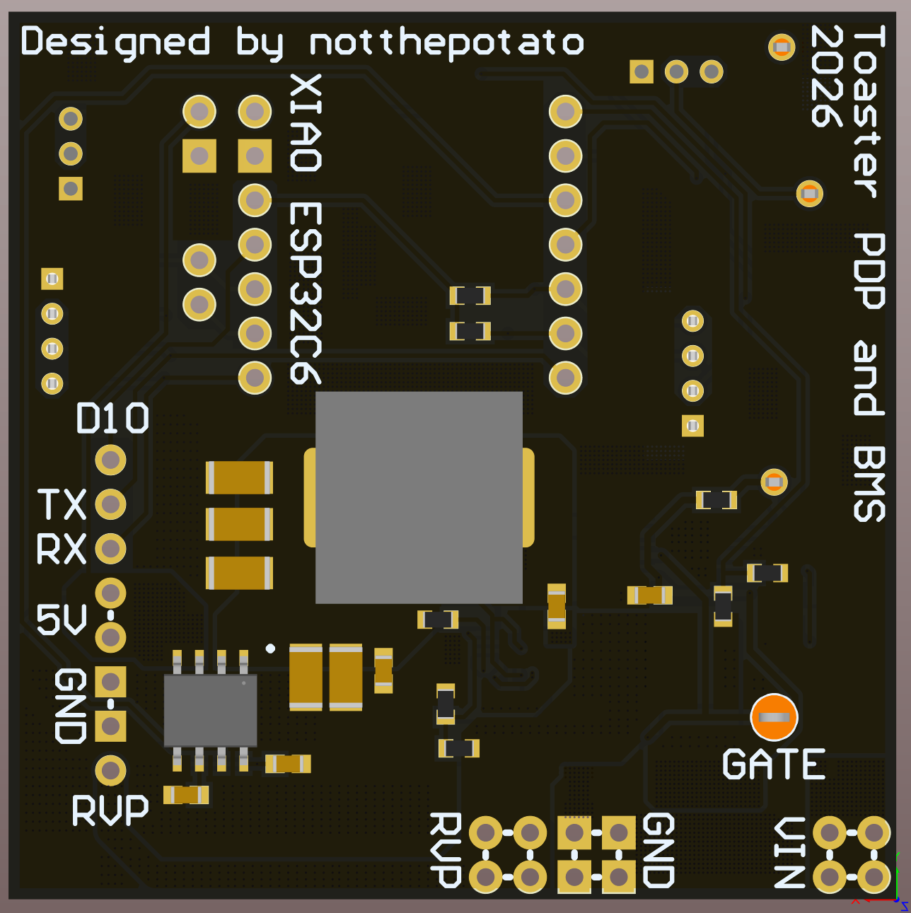

The toaster PDP is a power distibution panel that has a step down regulator that can do like 4V-36V (if I remember correctly). This monster packs many features too 
-

Features
-
- Reverse Voltage Protection ran by in indipendent IC 
- 5V out @ 10A continuous (as per the datasheet)
- Input and Output current sensing 
- enough headers to use all 10A 
- JST headers breaking out a bunch of things like fans and I2C and Serial
- A NEOPIXEL and NEOPIXEL pins, as well as easy to get to Test Points
 

09/03/2026
-
- Sorted out the schematics and PCB Layouts and stuff as well as having the designators in there own pdf
