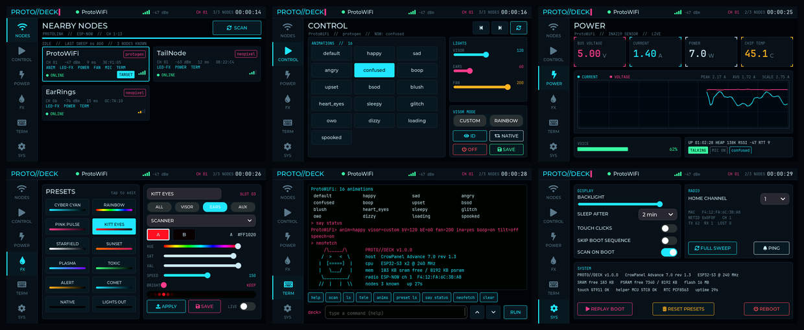

# PROTO//DECK

A touchscreen command deck for your protogen, running on the **Elecrow CrowPanel Advance 7.0" HMI (ESP32-S3)**.
It finds nearby ESP32s over **ESP-NOW**, shows live **current / voltage / power**, plays animations, pushes
**NeoPixel effect presets**, and has a full **terminal** (on-screen *and* over USB serial). It boots with a
CRT flash, a BIOS-style hardware report, a random handful of silly status lines, a *real* radio sweep that
lists the nodes it finds, and a glitchy logo reveal.




## What's in here

| Folder | Runs on | What it is |
|---|---|---|
| `ProtoDeck-Controller/` | CrowPanel Advance 7.0" | The deck firmware (LVGL 9 UI, boot sequence, ESP-NOW manager, terminal) |
| `ProtoLink-Node/` | any ESP32 | Arduino library that makes a board discoverable/controllable by the deck |
| `ProtoLink-Node/ProtoESP-Integration/` | your helmet (ProtoESP) | Drop-in glue + patch for [NCPlyn/ProtogenHelmet-ESP32](https://github.com/NCPlyn/ProtogenHelmet-ESP32) |
| `ProtoLink-Node/examples/GenericNeoPixelNode/` | any ESP32 + WS2812 strip | A tail / ears / chest-panel node - also the easiest way to test the deck on your desk |

All three were compile-tested against **arduino-esp32 3.3.12** (ProtoESP at commit `101b4d7`). The UI and boot
sequence were rendered with real LVGL in a desktop simulator (that's where the screenshots come from), but
they have **not** been run on physical hardware yet - see *First flash checklist* below.

---

## 1. Flash the deck (CrowPanel)

**Check your board revision** - it's printed on the back of the PCB (V1.0 / V1.2 / V1.3 / V1.4 / V1.5).
V1.0 is auto-detected. For **V1.2** set `#define BOARD_REV 12` in `ProtoDeck/config.h`. V1.3-V1.5 is the default.

### PlatformIO (recommended)
Open `ProtoDeck-Controller/` in VS Code + PlatformIO and press **Upload**. Done.

### Arduino IDE
1. Boards Manager: **esp32 by Espressif** 3.3.x
2. Library Manager: **lvgl** 9.2.2
3. Copy `ProtoDeck/lv_conf.h` into your `Arduino/libraries/` folder (next to the `lvgl` folder, not inside it)
4. Open `ProtoDeck/ProtoDeck.ino`, then Tools:
   - Board **ESP32S3 Dev Module**, Flash Size **16MB**, PSRAM **OPI PSRAM**
   - Partition Scheme **16M Flash (3MB APP/9.9MB FATFS)**, USB CDC On Boot **Disabled**
5. Upload

You do **not** need Elecrow's "120M PSRAM" replacement libraries - the display driver uses DMA bounce
buffers instead, which also keeps the picture stable while the radio is busy.

## 2. Make the helmet answer

Follow [`ProtoLink-Node/ProtoESP-Integration/README.md`](ProtoLink-Node/ProtoESP-Integration/README.md) -
it's two copied files and five one-line edits (a ready `.patch` is included). Your helmet keeps its WiFi
page, BLE remote, OLED and everything else; it just also speaks ESP-NOW.

For anything else (tail, ears, a test strip), flash `examples/GenericNeoPixelNode` after setting the pin,
LED count and name at the top.

## 3. Use it

| Page | What it does |
|---|---|
| **NODES** | SCAN sweeps channels 1-13; tap a card to make it the target |
| **CONTROL** | animation grid (current one is lit), prev/next, visor/ears/fan sliders, CUSTOM/RAINBOW visor, identify, native, LEDs off, save |
| **POWER** | live voltage / current / power / temperature tiles, 30 s current+voltage chart with peak/avg, voice level, boop/tilt/talking flags. An amber **EST** badge means there's no INA219 and current is estimated from what the LEDs are showing |
| **FX** | 12 preset slots. Edit zone, effect, two colours (hue/sat/val), speed, brightness, with a live LED preview strip. **APPLY** sends it, **SAVE** stores the slot, **LIVE** streams changes while you drag |
| **TERM** | the same terminal as USB serial, with quick-command chips, history and a keyboard |
| **SYS** | backlight, sleep timeout, touch clicks (V1.3+ buzzer), skip boot, scan on boot, home channel, radio stats, replay boot |

Every button goes through the terminal's command parser, so the TERM page doubles as a log of everything
you've done and what each node answered.

### Terminal commands
USB serial: **115200 baud**, newline line endings. `ansi on` turns on colours (PuTTY, `screen`, VS Code monitor).

```
scan [ch]                 sweep channels (or just one)
ls                        list nodes (> marks the target)
sel <n|name|mac-tail>     choose target            info [n]   details + last telemetry
ping                      round-trip time          stats      radio counters
tele [watch|stop]         read current/voltage/temp/anim/brightness/fan/mic
anims                     list animations          anim <name|next|prev>
bright <all|visor|ears> <0-255|NN%>                fan <0-255>
visor <custom|rainbow|toggle>                      id         blink the target
fx <zone> <effect> [c1] [c2] [speed] [bri]         off / native
   zones: all visor ears aux   effects: anim off solid breathe rainbow chase scanner
   sparkle gradient strobe plasma   colours: #RRGGBB or red/green/blue/cyan/pink/purple/white/orange/yellow
preset ls | apply <n> | show <n> | set <n> <name> <zone> <fx> <c1> <c2> [spd] [bri] | reset
say <text>                raw text to the node (on the helmet: ?, status, log, heap, rgb, an anim name...)
save                      node saves its config    reboot [deck]
ch [n]  bl <0-100>  sleep  beep  clicks on|off  ansi on|off  clear  history  neofetch
```

Examples: `fx ears scanner #ff1020 #080000 150` - `fx all solid cyan` - `bright visor 40%` - `say status`

### What the helmet does with each zone
- **Ears**: every effect, rendered by the helmet at 60 fps. The override sticks across animation changes until you send `native`.
- **Visor**: `solid` tints the face (overrides animation colours), `rainbow` uses ProtoESP's rainbow mode, `off` blanks it, `native` restores everything.
- **Aux**: for separate strips such as the generic node.

---

## How it works (ProtoLink)

Small binary packets over ESP-NOW (`protolink.h`, identical copy on both sides):
`DISCOVER` broadcast -> `HELLO` (name, kind, channel, capability bits) -> requests (`PING`, `GET telemetry/anims`,
`CMD`, free `TEXT`) -> replies (`PONG`, `TELEMETRY`, `LIST` chunks, `ACK` with a status + message).
The deck retries once after 450 ms and reports anything that still gets no answer.

ESP-NOW only works between radios on the **same WiFi channel**. ProtoESP's access point sits on channel 1 by
default, so that's the deck's home channel. A scan hops 1-13 so it also finds nodes elsewhere, and the deck
hops to a node's channel when you talk to it.

`PL_NET_ID` in `protolink.h` (default `0x0F0F`) is a filter so two decks at the same con don't fight over each
other's suits. It is **not** security - anyone with this code and your net id can send commands. Change it on
both sides if you care.

## First flash checklist / troubleshooting

- **Screen stays black**: wrong `BOARD_REV` (V1.2 vs V1.3 use different backlight commands). Watch the serial log.
- **Picture drifts or shimmers**: lower `LCD_PCLK_HZ` in `config.h` to 14 or 12 MHz.
- **Touch dead**: the boot log line "Capacitive touch (GT911)" shows FAIL; check `BOARD_REV`, power-cycle.
- **No nodes found**: the node must be running and in range; `scan` sweeps all channels. On the helmet, look
  for `[I] ProtoLink (ESP-NOW) ready` in its serial log / `/log` page.
- **Commands time out but scan works**: heavy BLE traffic on the helmet can drop the odd packet; the deck retries once.
- **No serial output from the deck**: toggle "USB CDC On Boot".

## Making it yours

- Boot flavour text: `FLAVOR[]` at the top of `ProtoDeck/boot.cpp` - add your own, 6 random ones run per boot.
  (Written in the spirit of Zack Freedman's Singularitron boot screen; the lines are original.)
- Colours: `C_*` in `ui.h`. Name and version: `config.h`.
- Default presets: `presets.cpp`. New node commands: add a `PL_CMD_*` and handle it in your `ProtoLinkDevice::onCommand`.

## Credits & licences

- ProtoESP by **NCPlyn** (GPL-3.0). `ProtoLinkGlue.h` is meant to be built into ProtoESP and is offered under
  GPL-3.0 to match; keep NCPlyn's credits, and if you sell builds, please donate to the project as the author asks.
- ProtoDeck controller + ProtoLink node library: MIT.
- [LVGL](https://lvgl.io) (MIT). JetBrains Mono font (SIL OFL 1.1, see `ProtoDeck/FONT_LICENSE_OFL.txt`).
- Board pin map and helper-MCU commands from Elecrow's official CrowPanel Advance 7.0 examples.
